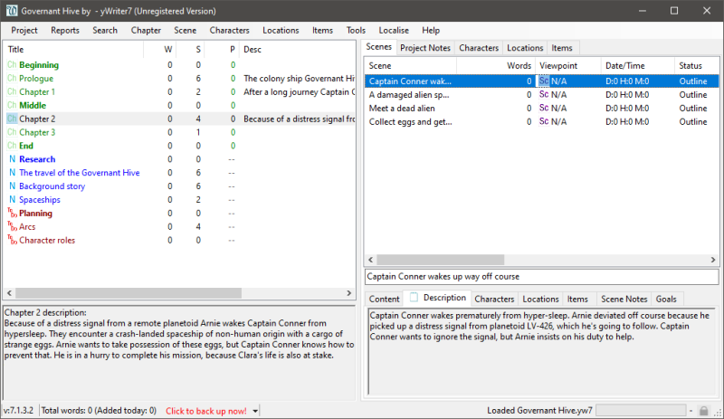

[yWriter](http://spacejock.com/yWriter7.html) is a free word processor written by Australian author and programmer Simon Haynes. 
[FreeMind](https://freemind.sourceforge.net/wiki/index.php/Main_Page) is a mind mapper software. *mm2yw7* is a Python script that exports outlines made with FreeMind to new yWriter projects.

## Features

- Converts three levels of the novel structure: Parts, chapters, and scenes.
- Converts a set of main characters.
- Converts a set of minor characters.
- Converts a set of locations.
- Converts a set of items.
- Makes the node label the title of the converted element.
- Makes the node notes the description of the converted element.
- The chapter/scene types can be set by specified icons.
- The icon specifications can be changed with a configuration file.
- A template mindmap is included with the distribution (see the *sample* folder).

## Requirements

- [Python](https://www.python.org/) version 3.6+.

## Download and install

[Download the latest release (version 0.4.2)](https://raw.githubusercontent.com/peter88213/mm2yw7/main/dist/mm2yw7_v0.4.2.zip)

- Unzip the downloaded zipfile "mm2yw7_v0.4.2.zip" into a new folder.
- Move into this new folder and launch **setup.pyw**. This installs the script for the local user.
- Create a shortcut on the desktop when asked.
- Open "README.md" for usage instructions.

### Note for Linux users

Please make sure that your Python3 installation has the *tkinter* module. On Ubuntu, for example, it is not available out of the box and must be installed via a separate package. 

------------------------------------------------------------------

[Changelog](changelog)

## Usage

See the [instructions for use](usage)

## Credits

- Frederik Lundh published the [xml pretty print algorithm](http://effbot.org/zone/element-lib.htm#prettyprint).

## License

mm2yw7 is distributed under the [MIT License](http://www.opensource.org/licenses/mit-license.php).

 

