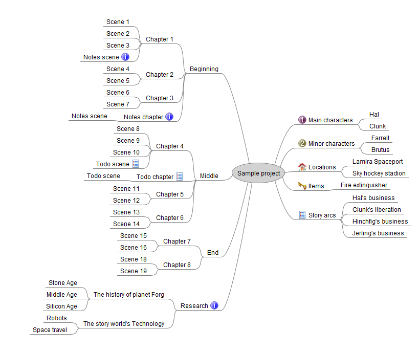

[Project homepage](https://peter88213.github.io/mm2yw7)

------------------------------------------------------------------

The mm2yw7 Python script creates a yWriter 7 project from a FreeMind outline.

## Instructions for use

### Intended usage

The included installation script prompts you to create a shortcut on the desktop. You can launch the program by dragging a *.mm* file and dropping it on the shortcut icon. 

### Command line usage

Alternatively, you can

- launch the program on the command line passing the mindmap file as an argument, or
- launch the program via a batch file.

usage: `mm2yw7.pyw [--silent] Sourcefile`

#### positional arguments:

`Sourcefile` 

The path of the mindmap.

#### optional arguments:

`--silent`  suppress error messages and the request to confirm overwriting

## Mode of operation

*mm2yw7* generates a new yWriter project file with the same file name as the mindmap file, 
but with the extension `.yw7`. It is placed in the same directory as the source file. 

Note: **If the yWriter project already exists, it would be overwritten after confirmation**. 
However, you can change the behavior with a configuration file entry (see below). Then 
an existing yw7 file is not overwritten. Character/Location/Item 
XML files are generated instead. They can be imported into any yWriter project.

## Conversion rules

- Converts elements on three levels of the novel structure: Parts, chapters, and scenes.
- Scene status is *Outline*.
- Converts a set of main characters.
- Converts a set of minor characters.
- Converts a set of locations.
- Converts a set of items.
- Makes the node label the title of the converted element.
- Makes the node notes the description of the converted element.


### The levels of the mindmap tree

- On the first level, a node represents either a *part* (a chapter beginning a new section), 
  or a collection of characters, locations, or items. The conversion of "Normal type parts" 
  can be suppressed with a configuration file entry, if you just want chapters and scenes. 
- On the second level, a node represents either a *chapter*, or a character/location/item. 
- On the third level. a node represents a *scene*. 

### The use of special icons

The conversion is controlled by nodes decorated with special icons. The icon specifications 
can be changed with configuration file entries (see below).


#### On the first level

This icon marks the *Main characters* branch: 
 

This icon marks the *Minor characters* branch: 


This icon marks the *Locations* branch: 


This icon marks the *Items* branch: 


#### On the first, second, or third level

This icon makes a node element and its children (if any) *Notes* type: 


This icon makes a node element and its children (if any) *Todo* type:


### Example mindmap



## Custom configuration

You can override the default settings by providing a configuration file. Be always aware that faulty entries may cause program errors. 

### Global configuration

An optional global configuration file can be placed in the configuration directory in your user profile. It is applied to any project. Its entries override mm2yw7's built-in constants. This is the path:
`c:\Users\<user name>\.pywriter\mm2yw7\config\mm2yw7.ini`
  
The setup script installs a sample configuration file containing mm2yw7's default values. You can modify or delete it. 

### Local project configuration

An optional project configuration file named `mm2yw7.ini` can be placed in your project directory, i.e. the folder containing your yWriter and Timeline project files. It is only applied to this project. Its entries override mm2yw7's built-in constants as well as the global configuration, if any.

### How to provide/modify a configuration file

The mm2yw7 distribution comes with a sample configuration file located in the `sample` subfolder. It contains mm2yw7's default settings and options. This file is also automatically copied to the global configuration folder during installation. You best make a copy and edit it.

- The SETTINGS section mainly refers to icons, i.e. The FreeMind icons that mark the nodes and branches in the mindmap. If you change them, the program might behave differently than described in the description of the conversion rules. 
- The OPTIONS section comprises options for regular program execution. 
- Comment lines begin with a `#` number sign. In the example, they refer to the code line immediately above.

This is the configuration explained: 

```
[SETTINGS]

locations_icon = gohome

# Icon that marks the location branch in the mindmap.

items_icon = password

# Icon that marks the item branch in the mindmap.

characters_icon = group

# Icon that marks the character branch in the mindmap.

notes_icon = info

# Icon that marks a "Notes" type part/chapter/scene.

todo_icon = list

# Icon that marks a "To do" type part/chapter/scene.

[OPTIONS]

export_scenes = Yes

# Yes: create scenes from the mindmap.

export_characters = Yes

# Yes: create characters from the mindmap.

export_locations = Yes

# Yes: create location from the mindmap.

export_items = Yes

# Yes: create items from the mindmap.

overwrite_yw7 = Yes

# Yes: overwrite existing yw7 project after confirmation.
# No: if the yw7 project exists, create XML character/location/item data files instead.

has_normal_parts = Yes

# Yes: Create parts from all first level nodes that contain chapters and scenes.
# No: Create parts from the first level nodes only if marked as "Notes" or "To do".

```

## Installation path

The setup script installs *mm2yw7.pyw* in the user profile. This is the installation path on Windows: 

`c:\Users\<user name>\.pywriter\mm2yw7`
    